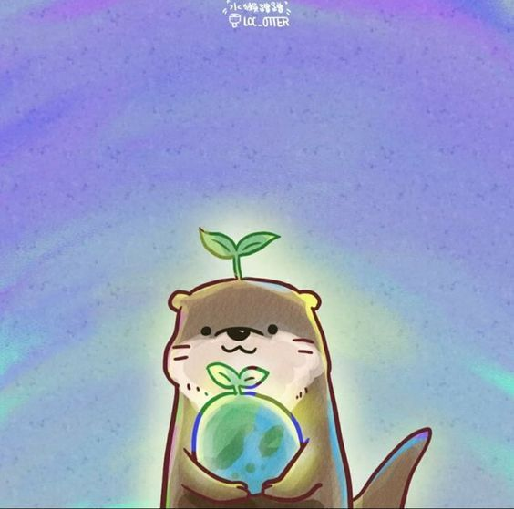
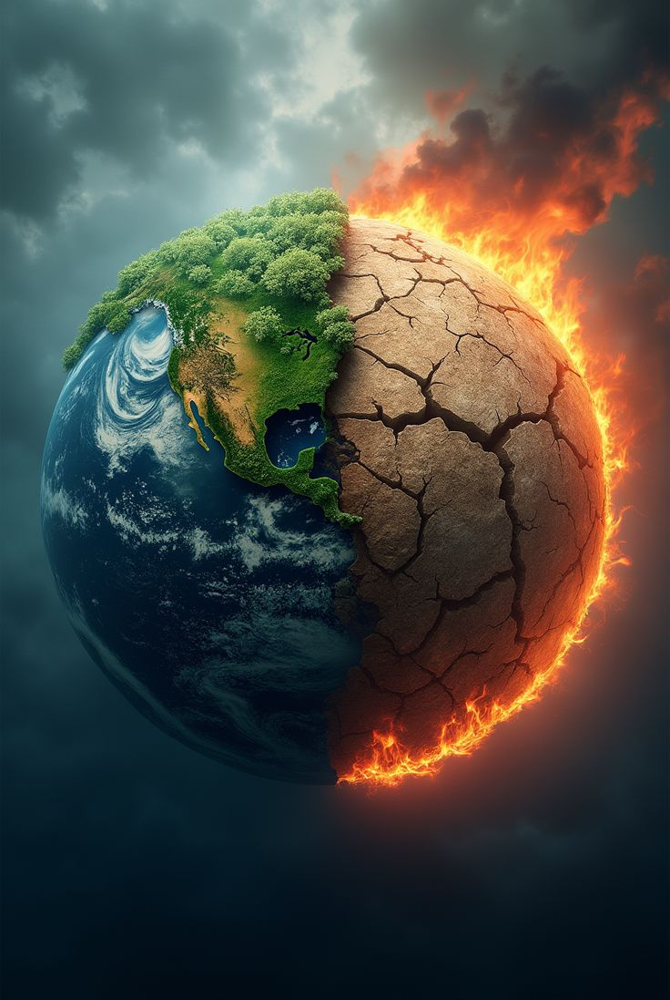
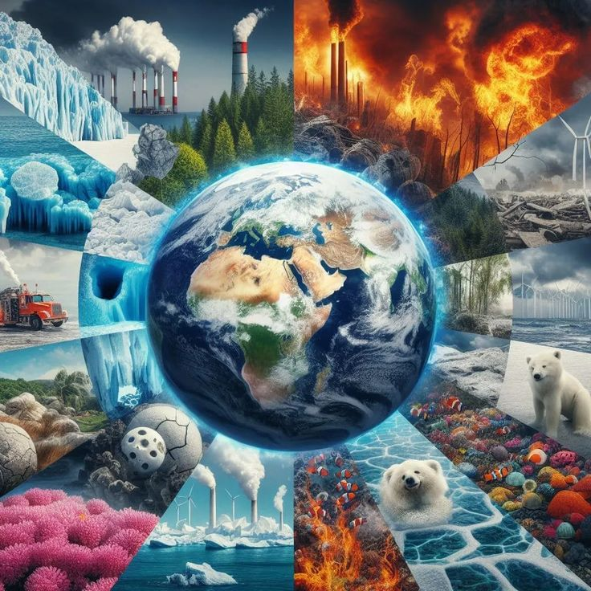
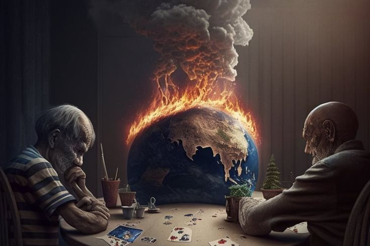
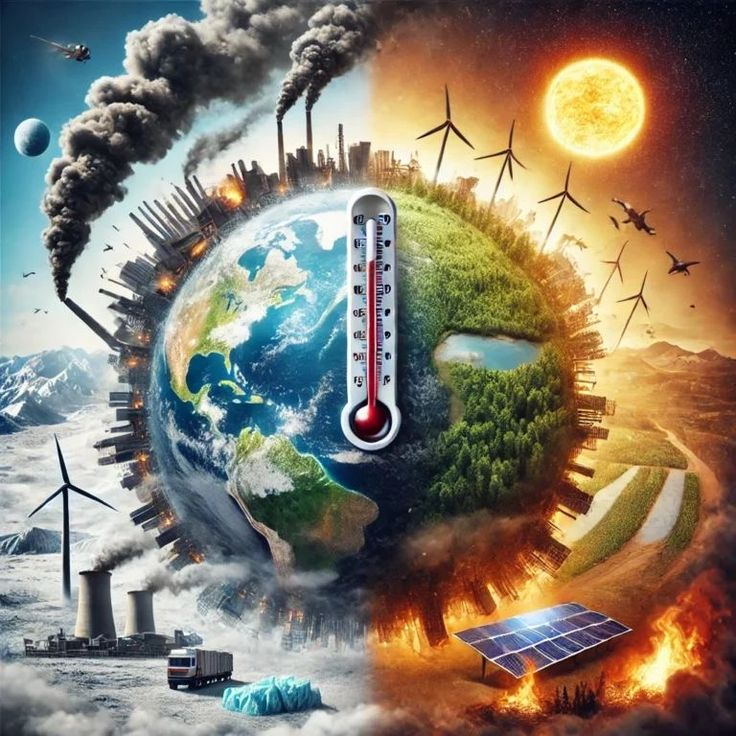
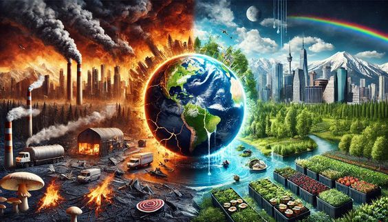

<!DOCTYPE html>
<html lang="es">
  <head>
    <meta charset="UTF-8" />
    <title>Cambios Climáticos</title>
    <link rel="stylesheet" href="dise.css" />
  </head>
  <body>
    <!-- lo que me ayuda a crear el fondo -->
    <canvas id="canvas"></canvas>

    <header>
      

      <h1>
        
        Cambios Climáticos
      </h1>
    </header>

    <nav class="navbar">
      <ul>
        <li>
          <button class="btn-nav">
            <a href="causas.html" class="a">causas</a>
          </button>
        </li>
        <li>
          <button class="btn-nav">
            <a href="conse.html" class="a">Conciencias</a>
          </button>
        </li>
        <li>
          <button class="btn-nav">
            <a href="impacto.html" class="a">Impactos</a>
          </button>
        </li>
        <li>
          <button class="btn-nav">
            <a href="solciones.html" class="a">Soluciones</a>
          </button>
        </li>
      </ul>
    </nav>

    

      <article class="articulo">
        <h2>¿Qué es el cambio climático?</h2>
        El cambio climático se refiere a los cambios a largo plazo de las
        temperaturas y los patrones climáticos. Estos cambios pueden ser
        naturales, debido a variaciones en la actividad solar o erupciones
        volcánicas grandes. Pero desde el siglo XIX, las actividades humanas han
        sido el principal motor del cambio climático, debido principalmente a la
        quema de combustibles fósiles como el carbón, el petróleo y el gas.
        <h2></h2>
      </article>
      <aside class="programada">
        <h3>⚡ "Conéctate con el futuro hoy"</h3>
        
La innovación está en tus manos.
✅ Herramientas digitales de última generación
✅ Seguridad garantizada
✅ Diseño moderno y fácil de usar

      </aside>
    

    

      <article class="articulo">
        <h2>El calentamiento global</h2>
        Se refiere al aumento en la temperatura promedio global de la Tierra,
        que se produce principalmente debido a la acumulación de gases de efecto
        invernadero en la atmósfera terrestre. Esto se traduce en el aumento de
        la temperatura del aire, el aumento del nivel del mar, el aumento de las
        precipitaciones, el cambio en los patrones de tormentas y el aumento de
        temperaturas extremas.
        <h2></h2>
      </article>
      <aside class="programada">
        <h3>👗 "Viste tu mejor versión"</h3>
        
La moda no es solo ropa, es actitud.
✨ Estilo único
✨ Tendencias exclusivas
✨ Calidad que brilla

      </aside>
    

    

      <article class="articulo">
        <h2>variabilidad climática</h2>
        Esto se refiere a los cambios en los patrones climáticos a corto plazo,
        como la variación de las temperaturas y las precipitaciones. Esto puede
        ser causado por factores naturales, como el movimiento de las placas
        tectónicas, o por factores humanos, como la quema de combustibles
        fósiles.
        <h2></h2>
      </article>
      <aside class="programada">
        <h3>
          🍔 "El sabor que estabas esperando"
         
        </h3>

        
Deliciosas hamburguesas hechas con pasión.
🔥 Ingredientes frescos
🔥 Preparación al momento
🔥 Sabor irresistible

      </aside>
    

    

      <article class="articulo">
        <h2>
          Los cambios climáticos tienen un gran impacto en el medio ambiente
        </h2>
        Esto incluye el calentamiento de los océanos, el aumento del nivel del
        mar, el aumento de la sequía y la erosión de la costa. También se espera
        que los cambios climáticos afecten la agricultura, la salud humana y los
        ecosistemas terrestres y marinos
        <h2></h2>
      </article>
      <aside class="programada">
        <h3>
💚 "Cuida tu cuerpo, cuida tu vida"</h3>
        
Tu bienestar es lo más importante.
🏃 Planes de ejercicio personalizados
🥗 Alimentación saludable
🧘 Bienestar físico y mental

      </aside>
    

    <title>Tipos de Cambios Climáticos</title>

    

      <article class="articulo">
        <h2>Aumento de las temperaturas en tierra</h2>
        Los registros de estaciones meteorológicas alrededor del mundo
        demuestran un incremento constante en las temperaturas promedio de la
        superficie terrestre. Esto ha generado olas de calor más intensas y
        prolongadas, así como sequías más severas que afectan directamente a los
        ecosistemas, la salud humana y la producción agrícola.
        <h2></h2>
      </article>
      <aside class="programada">
        <h3>✈️ "Tu próxima aventura te espera"</h3>
        
Explora el mundo como nunca antes.
🌴 Paquetes exclusivos
🏔️ Destinos increíbles
💼 Viaja fácil y seguro

      </aside>
    

    <footer class="pie">21/09/25</footer>

    <!-- Script de partículas y temas -->
    
  </body>
</html>
